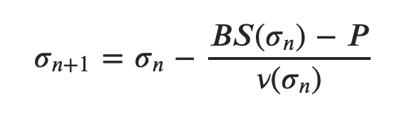

# guant

A simple go implemention of the [Black-Scholes pricing model](https://en.wikipedia.org/wiki/Black%E2%80%93Scholes_model) and [Newton-Raphson Method](https://www.risklatte.xyz/Articles/QuantitativeFinance/QF135.php). 

[Writeup](https://anthonylaiuppa.com/posts/guant)

##### Black Scholes pricing model:


##### Newton-Raphson Method:


##### Derivative Struct:
```	
        N     distuv.Normal  // Cumulative Normal Distribution function with {Mu: 0, Sigma: 1} 
   	S     float64        // S - stock price
   	K     float64        // K - strike price
   	R     float64        // r - risk free interest rate
   	Sigma float64        // sigma - std deviation of log returns (Implied volatility)
   	T     float64        // T - time to exercise date in years
```

#### Example usage:

```
    var currPrice float64 = 180.34
    var strike float64 = 185.00
    expiry := "2020-06-05"    
    t := guant.TimeToExpiry(expiry)

    // With provided contract price calculate Sigma
    var mid float64 = 0.11
	fmt.Println("Mid:", mid)
	x := guant.Derivative{
		N: distuv.Normal{Mu: 0, Sigma: 1},
		S: currPrice,
		K: strike,
		R: guant.DefaultRfir(),
		T: t,
	}
	x.Sigma = guant.NewtonRaphson(x, mid)
	y := guant.BlackScholes(x)

    //Given sigma calculate the value of a Call option
    var sigma float64 = 1.384
	i := guant.Derivative{
		N:     distuv.Normal{Mu: 0, Sigma: 1},
		S:     currPrice,
		K:     strike,
		R:     guant.DefaultRfir(),
		Sigma: sigma,
		T:     t,
	}
    a := guant.BlackScholes(i)

	fmt.Println("BS W/Given IV:", a)
	fmt.Println("BS W/Calculated IV:", y)
	fmt.Println("Calculated IV:", x.Sigma)
	fmt.Println("Given IV", i.Sigma)

```